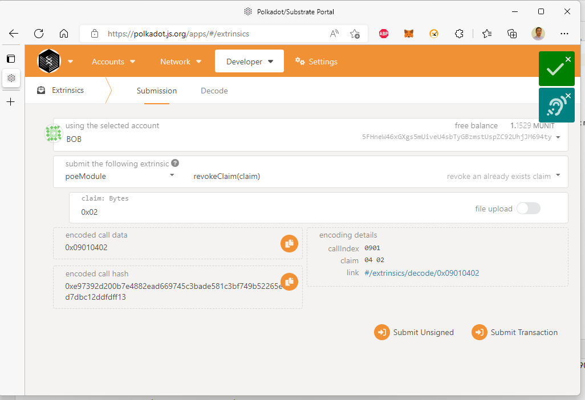

# poe pallet demo screenshots
## Create claim:

## Revoke claim(after transfer to Bob account):

## transfer claim:

## Whole demo gif for create, transfer and revoke:


# Substrate Node Template

A fresh FRAME-based [Substrate](https://www.substrate.io/) node, ready for hacking :rocket:

## Getting Started

Follow these steps to get started with the Node Template :hammer_and_wrench:

### Rust Setup

First, complete the [basic Rust setup instructions](./doc/rust-setup.md).

### Run

Use Rust's native `cargo` command to build and launch the template node:

```sh
cargo run --release -- --dev --tmp
```

### Build

The `cargo run` command will perform an initial build. Use the following command to build the node
without launching it:

```sh
cargo build --release
```

### Embedded Docs

Once the project has been built, the following command can be used to explore all parameters and
subcommands:

```sh
./target/release/node-template -h
```

## Run

The provided `cargo run` command will launch a temporary node and its state will be discarded after
you terminate the process. After the project has been built, there are other ways to launch the
node.

### Single-Node Development Chain

This command will start the single-node development chain with persistent state:

```bash
./target/release/node-template --dev
```

Purge the development chain's state:

```bash
./target/release/node-template purge-chain --dev
```

Start the development chain with detailed logging:

```bash
RUST_LOG=debug RUST_BACKTRACE=1 ./target/release/node-template -lruntime=debug --dev
```

### Multi-Node Local Testnet

If you want to see the multi-node consensus algorithm in action, refer to
[our Start a Private Network tutorial](https://substrate.dev/docs/en/tutorials/start-a-private-network/).

## Template Structure

A Substrate project such as this consists of a number of components that are spread across a few
directories.

### Node

A blockchain node is an application that allows users to participate in a blockchain network.
Substrate-based blockchain nodes expose a number of capabilities:

-   Networking: Substrate nodes use the [`libp2p`](https://libp2p.io/) networking stack to allow the
    nodes in the network to communicate with one another.
-   Consensus: Blockchains must have a way to come to
    [consensus](https://substrate.dev/docs/en/knowledgebase/advanced/consensus) on the state of the
    network. Substrate makes it possible to supply custom consensus engines and also ships with
    several consensus mechanisms that have been built on top of
    [Web3 Foundation research](https://research.web3.foundation/en/latest/polkadot/NPoS/index.html).
-   RPC Server: A remote procedure call (RPC) server is used to interact with Substrate nodes.

There are several files in the `node` directory - take special note of the following:

-   [`chain_spec.rs`](./node/src/chain_spec.rs): A
    [chain specification](https://substrate.dev/docs/en/knowledgebase/integrate/chain-spec) is a
    source code file that defines a Substrate chain's initial (genesis) state. Chain specifications
    are useful for development and testing, and critical when architecting the launch of a
    production chain. Take note of the `development_config` and `testnet_genesis` functions, which
    are used to define the genesis state for the local development chain configuration. These
    functions identify some
    [well-known accounts](https://substrate.dev/docs/en/knowledgebase/integrate/subkey#well-known-keys)
    and use them to configure the blockchain's initial state.
-   [`service.rs`](./node/src/service.rs): This file defines the node implementation. Take note of
    the libraries that this file imports and the names of the functions it invokes. In particular,
    there are references to consensus-related topics, such as the
    [longest chain rule](https://substrate.dev/docs/en/knowledgebase/advanced/consensus#longest-chain-rule),
    the [Aura](https://substrate.dev/docs/en/knowledgebase/advanced/consensus#aura) block authoring
    mechanism and the
    [GRANDPA](https://substrate.dev/docs/en/knowledgebase/advanced/consensus#grandpa) finality
    gadget.

After the node has been [built](#build), refer to the embedded documentation to learn more about the
capabilities and configuration parameters that it exposes:

```shell
./target/release/node-template --help
```

### Runtime

In Substrate, the terms
"[runtime](https://substrate.dev/docs/en/knowledgebase/getting-started/glossary#runtime)" and
"[state transition function](https://substrate.dev/docs/en/knowledgebase/getting-started/glossary#stf-state-transition-function)"
are analogous - they refer to the core logic of the blockchain that is responsible for validating
blocks and executing the state changes they define. The Substrate project in this repository uses
the [FRAME](https://substrate.dev/docs/en/knowledgebase/runtime/frame) framework to construct a
blockchain runtime. FRAME allows runtime developers to declare domain-specific logic in modules
called "pallets". At the heart of FRAME is a helpful
[macro language](https://substrate.dev/docs/en/knowledgebase/runtime/macros) that makes it easy to
create pallets and flexibly compose them to create blockchains that can address
[a variety of needs](https://www.substrate.io/substrate-users/).

Review the [FRAME runtime implementation](./runtime/src/lib.rs) included in this template and note
the following:

-   This file configures several pallets to include in the runtime. Each pallet configuration is
    defined by a code block that begins with `impl $PALLET_NAME::Config for Runtime`.
-   The pallets are composed into a single runtime by way of the
    [`construct_runtime!`](https://crates.parity.io/frame_support/macro.construct_runtime.html)
    macro, which is part of the core
    [FRAME Support](https://substrate.dev/docs/en/knowledgebase/runtime/frame#support-library)
    library.

### Pallets

The runtime in this project is constructed using many FRAME pallets that ship with the
[core Substrate repository](https://github.com/paritytech/substrate/tree/master/frame) and a
template pallet that is [defined in the `pallets`](./pallets/template/src/lib.rs) directory.

A FRAME pallet is compromised of a number of blockchain primitives:

-   Storage: FRAME defines a rich set of powerful
    [storage abstractions](https://substrate.dev/docs/en/knowledgebase/runtime/storage) that makes
    it easy to use Substrate's efficient key-value database to manage the evolving state of a
    blockchain.
-   Dispatchables: FRAME pallets define special types of functions that can be invoked (dispatched)
    from outside of the runtime in order to update its state.
-   Events: Substrate uses [events](https://substrate.dev/docs/en/knowledgebase/runtime/events) to
    notify users of important changes in the runtime.
-   Errors: When a dispatchable fails, it returns an error.
-   Config: The `Config` configuration interface is used to define the types and parameters upon
    which a FRAME pallet depends.

### Run in Docker

First, install [Docker](https://docs.docker.com/get-docker/) and
[Docker Compose](https://docs.docker.com/compose/install/).

Then run the following command to start a single node development chain.

```bash
./scripts/docker_run.sh
```

This command will firstly compile your code, and then start a local development network. You can
also replace the default command (`cargo build --release && ./target/release/node-template --dev --ws-external`)
by appending your own. A few useful ones are as follow.

```bash
# Run Substrate node without re-compiling
./scripts/docker_run.sh ./target/release/node-template --dev --ws-external

# Purge the local dev chain
./scripts/docker_run.sh ./target/release/node-template purge-chain --dev

# Check whether the code is compilable
./scripts/docker_run.sh cargo check
```
